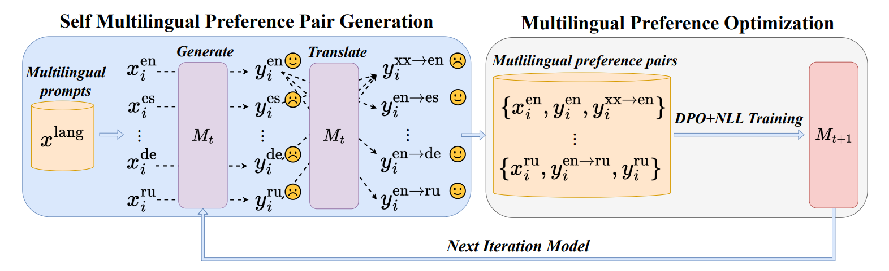
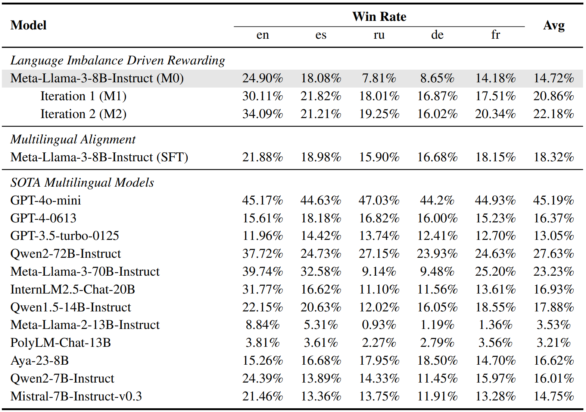
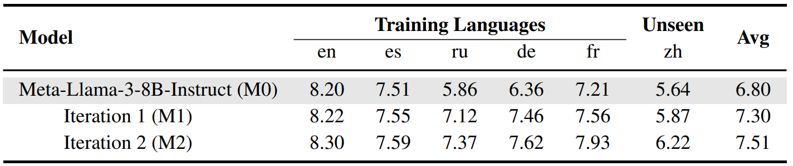
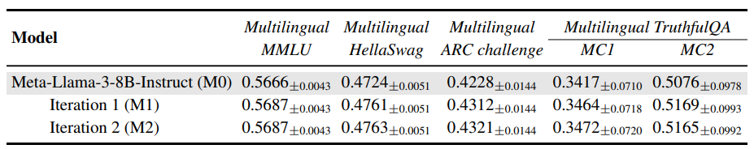
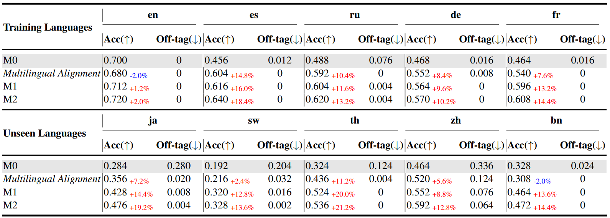

<!-- # Language Imbalance Driven Rewarding -->

# Language Imbalance Driven Rewarding for Multilingual Self-improving

<div align="center">
<br>
<a>Wen Yang</a><sup><span>1,2*</span></sup>, 
<a href="https://scholar.google.com/citations?user=Ci4l4yQAAAAJ&hl=zh-CN">Junhong Wu</a><sup><span>1,2*</span></sup>,
<a href="https://scholar.google.com/citations?user=FgrrqlAAAAAJ&hl=zh-CN">Chen Wang</a><sup><span>1,2</span></sup>,
<a href="https://scholar.google.com/citations?user=l8lvKOQAAAAJ&hl=zh-CN">Chengqing Zong</a><sup><span>1,2</span></sup>,
<a href="https://scholar.google.com/citations?user=93zngeYAAAAJ&hl=zh-CN">Jiajun Zhang</a><sup><span>1,2,3,4🌟</span></sup>,
<br>
    
\* Equal contribution 🌟 Corresponding author

<sup>1</sup> School of Artificial Intelligence, University of Chinese Academy of Sciences<br>
<sup>2</sup> Institute of Automation, Chinese Academy of Sciences<br>
<sup>3</sup> Wuhan AI Research
<sup>4</sup> Shanghai Artificial Intelligence Laboratory, Shanghai, China<br>
    
 <a href='https://arxiv.org/pdf/2410.08964'></a> 
</div>

<p align="center">
    
</p>

<font size=5><div align='center' >  [[📖 arXiv Paper](https://arxiv.org/pdf/2405.15232)] </div></font>

## Overview
We introduce **Language Imbalance Driven Rewarding**, a novel approach that leverages the inherent capability imbalance across different languages in large language models (LLMs) as a reward signal for iterative self-improvement. By applying iterative DPO training, our approach _not only enhances the performance of non-dominant languages but also improves outcomes in dominant languages._ 

Our goal with this approach is to contribute a new perspective to the multilingual LLM community by challenging the assumption that language imbalance is solely a challenge to be mitigated. We hope this approach will inspire further exploration into _multilingual self-improvement_ in LLMs, broadening the horizon for more balanced and capable language models.

## 🔥 Update
- [01/08/2025] We have released all checkpoints used in our work  on [🤗HuggingFace](https://huggingface.co/collections/James-WYang/language-imbalance-driven-rewarding-68871dd4f0f7573b8e1d059a). Apologies for the delay!
- [23/01/2025]🍉Language Imbalance Driven Rewarding has been accepted by ICLR 2025!
- [28/10/2024]🔥We release the [code](https://github.com/ZNLP/Language-Imbalance-Driven-Rewarding) for Language Imbalance Driven Rewarding!
- [11/10/2024]🔥Language Imbalance Driven Rewarding is coming! We release the [paper](https://arxiv.org/pdf/2405.15232)!

## 👀 Contents
- [Models](#Models)
- [Setup](#Setup)
- [Preparation](#Preparation)
- [Train](#Train)
- [Evaluation](#Evaluation)
- [Experiments](#Experiments)
- [Citation](#citation)

## 🔓 Models
| Model Name                                                                                 | 🤗HuggingFace   |
|--------------------------------------------------------------------------------------------|--------|
| LIDR_M0_Qwen2-7B-Instruct_en_es_ru_de_fr                                                  | https://huggingface.co/James-WYang/LIDR_M0_Qwen2-7B-Instruct_en_es_ru_de_fr    |
| LIDR_M0_Llama-2-7b-chat-hf_en_es_ru_de_fr                                                 | https://huggingface.co/James-WYang/LIDR_M0_Llama-2-7b-chat-hf_en_es_ru_de_fr    |
| LIDR_M0_Llama-2-7b-chat-hf_en_ja_ko_it_th                                                 | https://huggingface.co/James-WYang/LIDR_M0_Llama-2-7b-chat-hf_en_ja_ko_it_th    |
| LIDR_M0_Meta-Llama-3-8B-Instruct_en_es_ru_de_fr                                          | https://huggingface.co/James-WYang/LIDR_M0_Meta-Llama-3-8B-Instruct_en_es_ru_de_fr    |
| LIDR_M0_Meta-Llama-3-8B-Instruct_translate_by_system_en_th_bn_sw                         | https://huggingface.co/James-WYang/LIDR_M0_Meta-Llama-3-8B-Instruct_translate_by_system_en_th_bn_sw    |
| LIDR_M0_Meta-Llama-3-8B-Instruct_en_th_bn_sw                                             | https://huggingface.co/James-WYang/LIDR_M0_Meta-Llama-3-8B-Instruct_en_th_bn_sw    |
| LIDR_M1_Qwen2-7B-Instruct_en_es_ru_de_fr                                                  | https://huggingface.co/James-WYang/LIDR_M1_Qwen2-7B-Instruct_en_es_ru_de_fr    |
| LIDR_M1_Llama-2-7b-chat-hf_en_es_ru_de_fr                                                 | https://huggingface.co/James-WYang/LIDR_M1_Llama-2-7b-chat-hf_en_es_ru_de_fr    |
| LIDR_M1_Llama-2-7b-chat-hf_en_ja_ko_it_th                                                 | https://huggingface.co/James-WYang/LIDR_M1_Llama-2-7b-chat-hf_en_ja_ko_it_th    |
| LIDR_M1_Meta-Llama-3-8B-Instruct_en_es_ru_de_fr                                          | https://huggingface.co/James-WYang/LIDR_M1_Meta-Llama-3-8B-Instruct_en_es_ru_de_fr    |
| LIDR_M1_Meta-Llama-3-8B-Instruct_translate_by_system_en_th_bn_sw                         | https://huggingface.co/James-WYang/LIDR_M1_Meta-Llama-3-8B-Instruct_translate_by_system_en_th_bn_sw    |
| LIDR_M1_Meta-Llama-3-8B-Instruct_en_th_bn_sw                                             | https://huggingface.co/James-WYang/LIDR_M1_Meta-Llama-3-8B-Instruct_en_th_bn_sw    |
| LIDR_Multilingual_Reasoning_M0_Meta-Llama-3-8B-Instruct_en_es_ru_de_fr                  | https://huggingface.co/James-WYang/LIDR_Multilingual_Reasoning_M0_Meta-Llama-3-8B-Instruct_en_es_ru_de_fr    |
| LIDR_Multilingual_Reasoning_M1_Meta-Llama-3-8B-Instruct_en_es_ru_de_fr                  | https://huggingface.co/James-WYang/LIDR_Multilingual_Reasoning_M1_Meta-Llama-3-8B-Instruct_en_es_ru_de_fr    |


## 📷 Setup

Please follow the instructions below to install the required packages.


1. Clone this repository

```bash
https://github.com/ZNLP/Language-Imbalance-Driven-Rewarding.git
```

2. Install Package

```bash
conda create -n mdpo python=3.10 -y
conda activate mdpo
cd Language-Imbalance-Driven-Rewarding
pip install -r requirements.txt
```

## 💡 Preparation


```bash
bash ./scripts/batch_inference.sh
```

```bash
bash ./scripts/batch_translate.sh
```


## 📈 Train

Our training is mostly performed on [LLaMA-Factory](https://github.com/hiyouga/LLaMA-Factory) code base. Please refer to that repo for more details.

## 📈 Evaluation

```bash
bash scripts/batch_inference_for_eval.sh
```

## 👀 Experiments

We provide some results in this section. More detailed results can be found in our paper.

### General Instruction Following

+ Head-to-head Performance
<div align=center>

</div>

+ X-alpacaEval 
<div align=center>

</div>

<div align='center'>
<details>
<summary>Click to expand more examples</summary>
<p align="center">
    
    <p align="center">The Multilingual MT-Bench Benchmark</p>
    
    <p align="center">The Multilingual NLP Benchmarks</p>
</p>
</details>
</div>

### Arithmetic Reasoning
+ Performances on MGSM benchmark
<div align=center>

</div>

## Schedule

- ☑️ Release training & evaluation code

- ☑️ Release ALL checkpoints

## Citation

If you find this repo useful for your research, please consider citing the paper

```
@article{yang2024language,
  title={Language Imbalance Driven Rewarding for Multilingual Self-improving},
  author={Yang, Wen and Wu, Junhong and Wang, Chen and Zong, Chengqing and Zhang, Jiajun},
  journal={arXiv preprint arXiv:2410.08964},
  year={2024}
}
```

## Acknowledgement

We would like to thank the following repos for their great work:
- This work utilizes the great work from [LLaMA-Factory](https://github.com/hiyouga/LLaMA-Factory), [Vllm](https://github.com/vllm-project/vllm), [transformers](https://github.com/huggingface/transformers), [LLaMA](https://github.com/facebookresearch/llama), [Qwen2](https://qwenlm.github.io/blog/qwen2/)
## License

This project is released under the [Apache 2.0 license](https://github.com/RainBowLuoCS/DEEM/blob/main/LICENSE). Parts of this project contain code and models from other sources, which are subject to their respective licenses.
