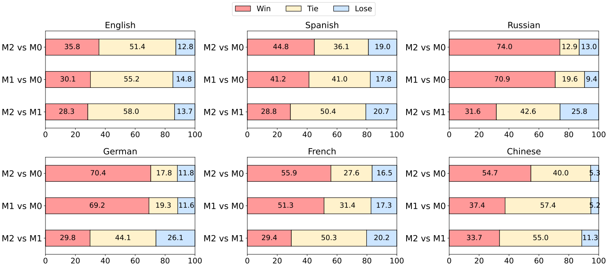

<!-- # Language Imbalance Driven Rewarding -->

# Language Imbalance Driven Rewarding for Multilingual Self-improving

<div align="center">
<br>
<a>Wen Yang</a><sup><span>1,2*</span></sup>, 
<a href="https://scholar.google.com/citations?user=Ci4l4yQAAAAJ&hl=zh-CN">Junhong Wu</a><sup><span>1,2*</span></sup>,
<a href="https://scholar.google.com/citations?user=FgrrqlAAAAAJ&hl=zh-CN">Chen Wang</a><sup><span>1,2</span></sup>,
<a href="https://scholar.google.com/citations?user=l8lvKOQAAAAJ&hl=zh-CN">Chengqing Zong</a><sup><span>1,2</span></sup>,
<a href="https://scholar.google.com/citations?user=93zngeYAAAAJ&hl=zh-CN">Jiajun Zhang</a><sup><span>1,2,3,4🌟</span></sup>,
<br>
    
\* Equal contribution 🌟 Corresponding author

<sup>1</sup> School of Artificial Intelligence, University of Chinese Academy of Sciences<br>
<sup>2</sup> Institute of Automation, Chinese Academy of Sciences<br>
<sup>3</sup> Wuhan AI Research
<sup>4</sup> Shanghai Artificial Intelligence Laboratory, Shanghai, China<br>
    
 <a href='https://arxiv.org/pdf/2410.08964'></a> 
</div>

<p align="center">
    
</p>

<font size=5><div align='center' >  [[📖 arXiv Paper](https://arxiv.org/pdf/2405.15232)] </div></font>
DEEM is an exploration of using diffusion models as the eyes of multi-modal large language models, with the goal of eliminating potential biases in different visual encoders from a vision-centric perspective. We hope that DEEM can bring some thinking to the multimodal community, whether the unbiased diffusion model can replace the traditional visual encoder and become the second unified multimodal structure besides self-regression.

## 🔥 Update

- [28/10/2024]🔥We release the [code](https://github.com/james-yw/Language-Imbalance-Driven-Rewarding) for Language Imbalance Driven Rewarding!
- [11/10/2024]🔥Language Imbalance Driven Rewarding is coming! We release the [paper](https://arxiv.org/pdf/2405.15232)!

## 👀 Contents

- [Setup](#Setup)
- [Preparation](#Preparation)
- [Train](#Train)
- [Evaluation](#Evaluation)
- [Experiments](#Experiments)
- [Citation](#citation)


## 📷 Setup

Please follow the instructions below to install the required packages.


1. Clone this repository

```bash
https://github.com/james-yw/Language-Imbalance-Driven-Rewarding.git
```

2. Install Package

```bash
conda create -n mdpo python=3.10 -y
conda activate mdpo
cd Language-Imbalance-Driven-Rewarding
pip install -r requirements.txt
```

## 💡 Preparation


```bash
bash ./scripts/batch_inference.sh
```

```bash
bash ./scripts/batch_translate.sh
```


## 📈 Train

Our training is mostly performed on [LLaMA-Factory](https://github.com/hiyouga/LLaMA-Factory) code base. Please refer to that repo for more details.

## 📈 Evaluation

```bash
bash scripts/ebatch_inference_for_eval.sh
```

## 👀 Experiments

We provide some results in this section. More detailed results can be found in our paper.

### General Instruction Following

+ Head-to-head Performance
<div align=center>

</div>

+ X-alpacaEval 
<div align=center>

</div>

<div align='center'>
<details>
<summary>Click to expand more examples</summary>
<p align="center">
    
    <p align="center">The Multilingual MT-Bench Benchmark</p>
    
    <p align="center">The Multilingual NLP Benchmarks</p>
</p>
</details>
</div>

### Arithmetic Reasoning
+ Performances on MGSM benchmark o
<div align=center>

</div>

## Schedule

- [x] Release training & evaluation code

- [ ] Release GPT-4 Score code

## Citation

If you find this repo useful for your research, please consider citing the paper

```
@article{yang2024language,
  title={Language Imbalance Driven Rewarding for Multilingual Self-improving},
  author={Yang, Wen and Wu, Junhong and Wang, Chen and Zong, Chengqing and Zhang, Jiajun},
  journal={arXiv preprint arXiv:2410.08964},
  year={2024}
}
```

## Acknowledgement

We would like to thank the following repos for their great work:
- This work utilizes the great work from [LLaMA-Factory](https://github.com/hiyouga/LLaMA-Factory), [Vllm](https://github.com/vllm-project/vllm), [transformers](https://github.com/huggingface/transformers), [LLaMA](https://github.com/facebookresearch/llama), [Qwen2](https://qwenlm.github.io/blog/qwen2/)
## License

This project is released under the [Apache 2.0 license](https://github.com/RainBowLuoCS/DEEM/blob/main/LICENSE). Parts of this project contain code and models from other sources, which are subject to their respective licenses.
